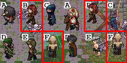
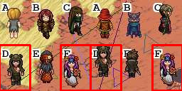

# margo-antycaptcha

## Files structure

### 1. (`data_generator/`)

- **`data_generator.py`** - main dataset generation script. Takes random backgrounds, pastes game character sprites on them, adds letters A-F, adds some random noise (colored lines and triangles to make it more realistic) and generates image pairs for model training. Saves everything as JPEGs + CSV with labels.

- **`mask_data_generator.py`** - similar to above, but generates data for training a segmentation model (U-Net). Creates images + binary masks showing where the character is and where the background is.

- **`binarize.py`** - simple script to convert images to binary masks (black and white) based on a threshold.

- **`parse_raw_backgrounds.py`** - for parsing raw bg's from `data/backgrounds/raw/`

- **`outfits_scrapper.py`** - script to scrape character sprites from the game files and save them in `data/outfits/data/`

### 2. (`sprite_mask_model/`)

U-net for detecting the character in the images. Needed to extract the character from the background before comparison.

- **`sprite_detector_model.py`** - definition and training of U-Net model. Input is 64x40 image, output is binary mask where the character is.

- **`MaskDataset.py`** - class for keras

- **`sprite_mask_unet.keras`** - model file

- **`train_model.ipynb`** i **`inference.ipynb`** - notebooks

### 3. (`comapre_two_model/`)

Actual captcha solver.

- **`captcha_solver.py`** - main solver for raw captcha images

- **`captcha_solver.ipynb`** - notebook demo

- **`train_model.ipynb`** - training

### 4. Dane (`data/`)

- **`backgrounds/`** -
  - `raw/` - raw backgrounds scraped from the web
  - `data/` - processed backgrounds (resized/cropped)

- **`captcha/`** -
  - `dataset/` - full dataset
  - `game_probes/` - real in-game captcha samples
    - `mask_dataset/` - dataset for training U-Net (images + masks)

- **`outfits/`** -
  - `outfits.csv` - metdata
  - `data/` - jpgs of character sprites (4x4 frames each)

### 5. (`tests/`)

- **`test_data_generator_visual.py`** - visual tests for data generator

## what does it do?
The model returns list of the letters for the parts, which contain the same frame of the character

For example, there its `[B. F]`:

And for this one model returns `[D, F]`:

